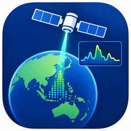

<p align="center">
  
</p>

<h1 align="center">GEDI Process Desktop</h1>

<p align="center">
星载激光雷达 <b>GEDI L1B / L2A</b> 光斑浏览与波形处理桌面工具<br/>
Desktop tool for browsing and processing GEDI L1B / L2A footprints and waveforms
</p>

---

## 语言 / Languages

**中文** 在前，**English** 在后（见文末）。

---

## 中文

本仓库同时提供两套实现：

| 目录 | 技术栈 | 说明 |
|------|--------|------|
| [`python/`](python/) | Python 3.10+ / PySide6 | 完整功能，易扩展（注册中心） |
| [`cpp/`](cpp/) | C++17 / Qt 6 | 高性能重写，在线底图 + 本地瓦片 + 原生 GeoTIFF |

界面工作流：左侧图层树 → 中间光斑地图 → 右侧波形（高度 ↑ / 强度 →）。

### 功能

- 导入 GEDI **L1B / L2A** HDF5，显示光斑位置
- 点击光斑查看 **回波波形**（L1B）或 **相对高度剖面**（L2A `rh`）
- 地图 **EPSG:4326**（plate carrée，与 QGIS 一致）；拖动、光标锚点缩放、点选
- **在线底图**（可关）：Esri 影像 / 山体阴影、NASA Blue Marble、OSM
- **本地栅格 / GeoTIFF**：程序内 C++ 解码（无需 Python），可选 `.gedi_tiles` 金字塔
- **波形处理**：SG/中值/高斯、Butterworth 低/高/带通/带阻、Hilbert 包络、导数/积分、
  FFT 幅度/相位/PSD、**IFFT 逆变换**、频谱去噪、重采样等
- 指标计算 + 多文件批处理（CSV）、HDF5 查看器、波形计算器
- 界面 **中文 / English**

### 快速开始（Python）

```bash
cd python
pip install -r requirements.txt
python main.py
```

### 快速开始（C++ / Qt 6）

```bat
cd cpp
cmake -S . -B build -DQT_ROOT=C:\Qt\6.10.1\mingw_64
cmake --build build -j
:: 或 tools\build.bat
```

### Windows 安装包（Inno Setup）

```bat
cd cpp
tools\build.bat
cd ..\packaging
pack_cpp.bat
```

默认安装路径：`C:\Program Files (x86)\GEDIProcessDesktopCpp`  
产物：`packaging\installer_output\GEDIProcessDesktopCpp-1.0.0-Setup.exe`

### 环境变量（可选）

| 变量 | 作用 |
|------|------|
| `GEDI_PYTHON` | Python 解释器（仅冷门 GeoTIFF 压缩回退） |
| `GEDI_TOOLS_DIR` | `tools/*.py` 目录 |
| `GEDI_SAMPLE_DIR` | 示例数据目录 |
| `GEDI_HDF5_DLL` / `GEDI_HDF5_BIN` | HDF5 / `h5dump` |

**GeoTIFF** 默认由内置 C++ 解码（未压缩 / PackBits / LZW / Deflate，8/16 位），不依赖 Python。

### 仓库结构

```
gedi-process-desktop/
├── README.md
├── LICENSE
├── packaging/          Inno Setup 脚本 + 安装包图标
├── python/             PySide6 实现
└── cpp/                Qt 6 C++ 实现
    ├── assets/         app.ico / app.png（可替换）
    ├── CMakeLists.txt
    ├── src/
    └── tools/
```

### Logo / 图标

替换 `cpp/assets/app.ico` 与 `cpp/assets/app.png` 后重新构建，即可更新程序与安装包图标。

### 联系方式

- Email：[tangh@std.uestc.edu.cn](mailto:tangh@std.uestc.edu.cn)

---

## English

Two implementations in this repository:

| Path | Stack | Notes |
|------|--------|--------|
| [`python/`](python/) | Python 3.10+ / PySide6 | Full features, plugin registry |
| [`cpp/`](cpp/) | C++17 / Qt 6 | Fast rewrite: basemap, tile pyramid, native GeoTIFF |

### Features

- Load GEDI **L1B / L2A** HDF5 footprints
- Waveform (L1B) or relative height (L2A) for each footprint
- Map in **EPSG:4326** (plate carrée, like QGIS); pan, cursor-anchored zoom, pick
- **Online basemaps**: Esri Imagery / Shaded Relief, NASA Blue Marble, OSM
- **Local raster / GeoTIFF**: decoded natively in C++ (no Python), optional `.gedi_tiles`
- **Signal processing**: SG/median/Gaussian, Butterworth LP/HP/BP/BS, Hilbert envelope,
  derivative/integral, FFT magnitude/phase/PSD, **IFFT**, spectral denoise, resample, …
- Metrics + batch CSV, HDF5 viewer, waveform calculator
- UI in **Chinese / English**

### Quick start (Python)

```bash
cd python
pip install -r requirements.txt
python main.py
```

### Quick start (C++ / Qt 6)

```bat
cd cpp
cmake -S . -B build -DQT_ROOT=C:\Qt\6.10.1\mingw_64
cmake --build build -j
:: or tools\build.bat
```

### Windows installer (Inno Setup)

```bat
cd cpp
tools\build.bat
cd ..\packaging
pack_cpp.bat
```

Default install dir: `C:\Program Files (x86)\GEDIProcessDesktopCpp`  
Output: `packaging\installer_output\GEDIProcessDesktopCpp-1.0.0-Setup.exe`

### Environment variables (optional)

| Variable | Purpose |
|----------|---------|
| `GEDI_PYTHON` | Python (only rare GeoTIFF codecs fallback) |
| `GEDI_TOOLS_DIR` | `tools/*.py` directory |
| `GEDI_SAMPLE_DIR` | Sample data folder |
| `GEDI_HDF5_DLL` / `GEDI_HDF5_BIN` | HDF5 / `h5dump` |

**GeoTIFF** is decoded natively in C++ (uncompressed / PackBits / LZW / Deflate, 8/16-bit) — no Python required.

### Logo

Replace `cpp/assets/app.ico` and `cpp/assets/app.png`, then rebuild to refresh app and installer icons.

### Contact

- Email: [tangh@std.uestc.edu.cn](mailto:tangh@std.uestc.edu.cn)

### License

See [LICENSE](LICENSE) (MIT).
